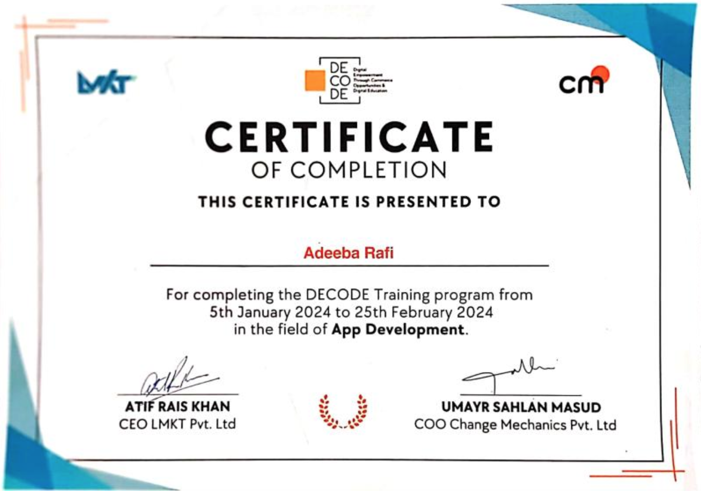
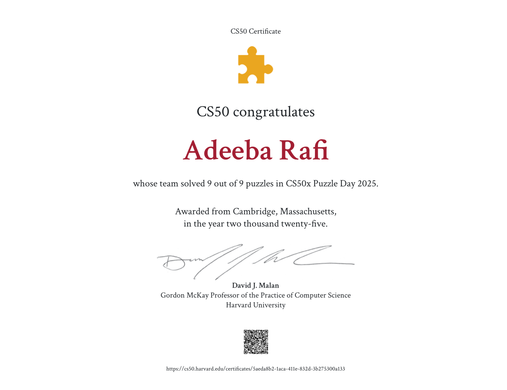
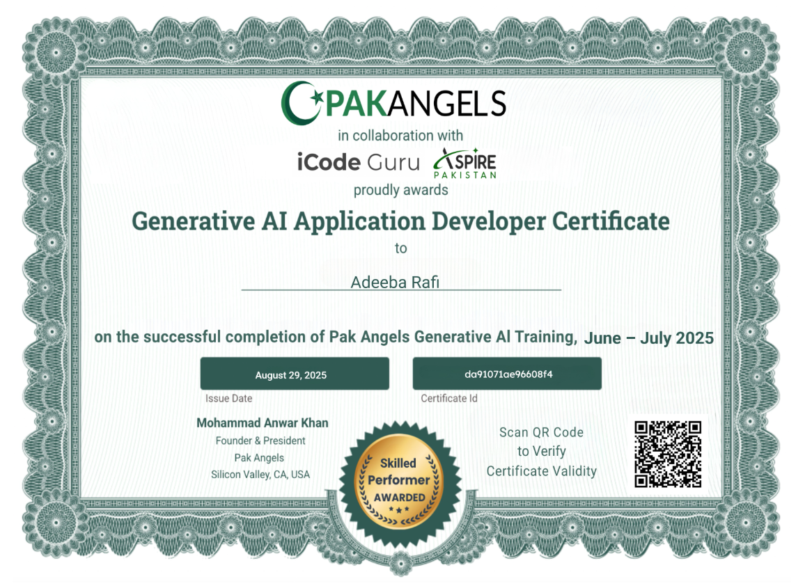
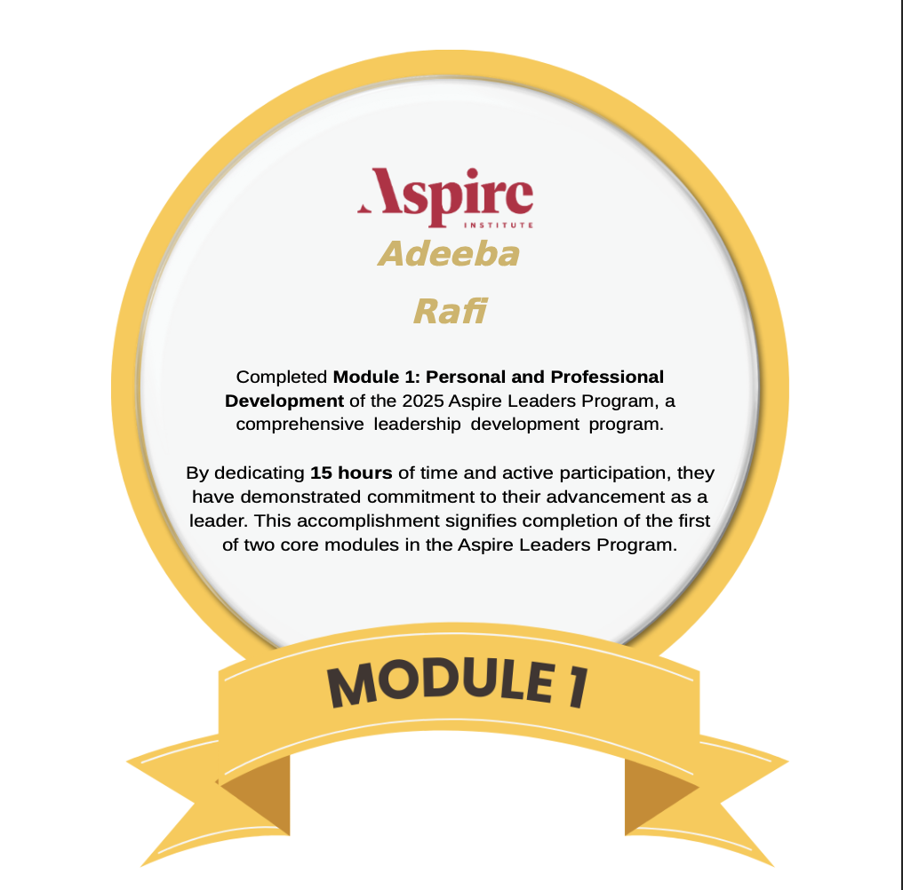
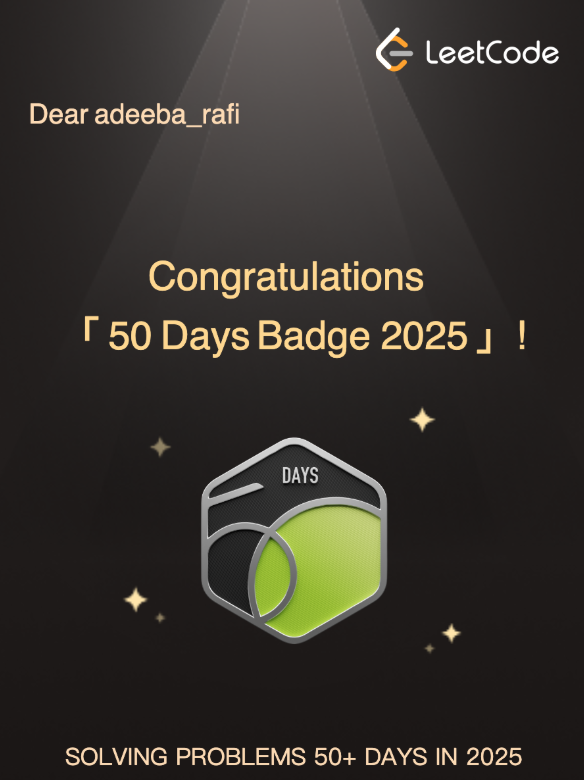
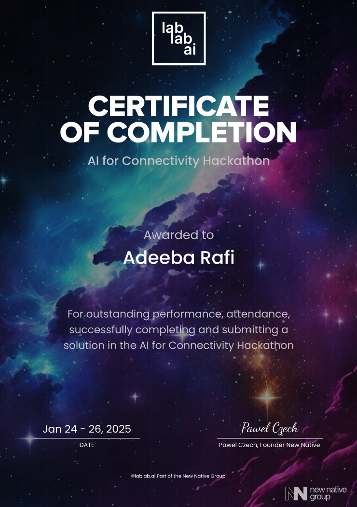

## Welcome to My GitHub Profile!

I am currently looking for graduate positions and opportunities to get involved in research during my master’s studies. I’m eager to learn, grow, and contribute to meaningful projects.

##  Certificates

  
  
  

  
  
  

**Education:** Completed my undergraduate degree in Computer Science with a GPA of 3.44/4.0.  
**Current Focus:** Actively solving LeetCode problems to strengthen problem-solving skills.  
**How to reach me:** adeebarafi12@gmail.com  

**Fun Fact:** Other than coding, I’m a big fan of traveling, playing badminton, and enjoying good food.  

## Connect with me  

